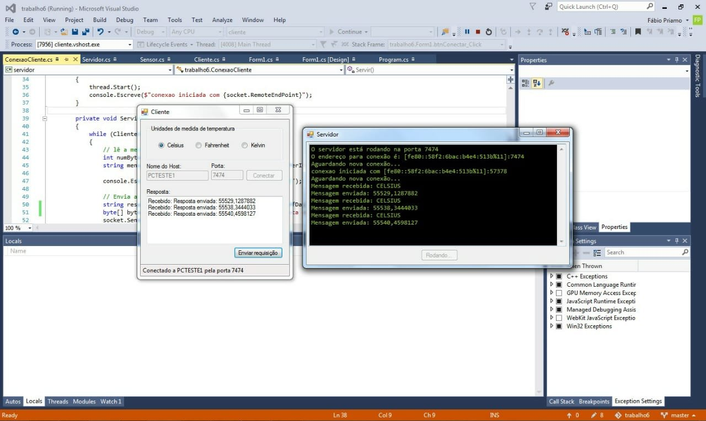

# trabalho6
University project n° 6

Simple C# WinForms application to demonstrate client-server architecture in practice.

## Language constraint

The university professor required that all code identifiers, file names and comments in this project were in portuguese. Sorry for that. 
